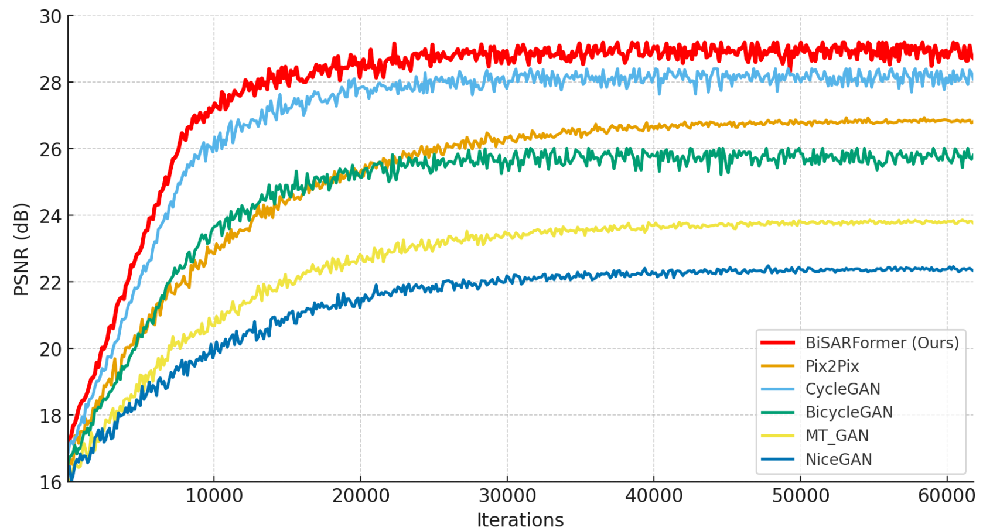
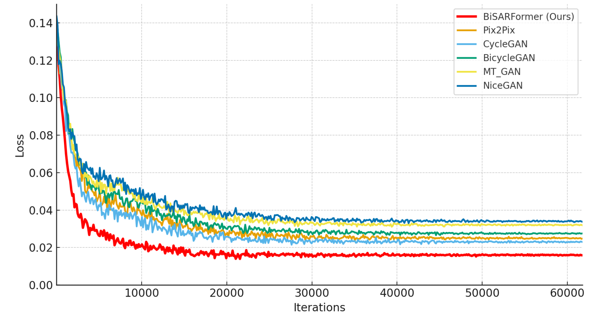
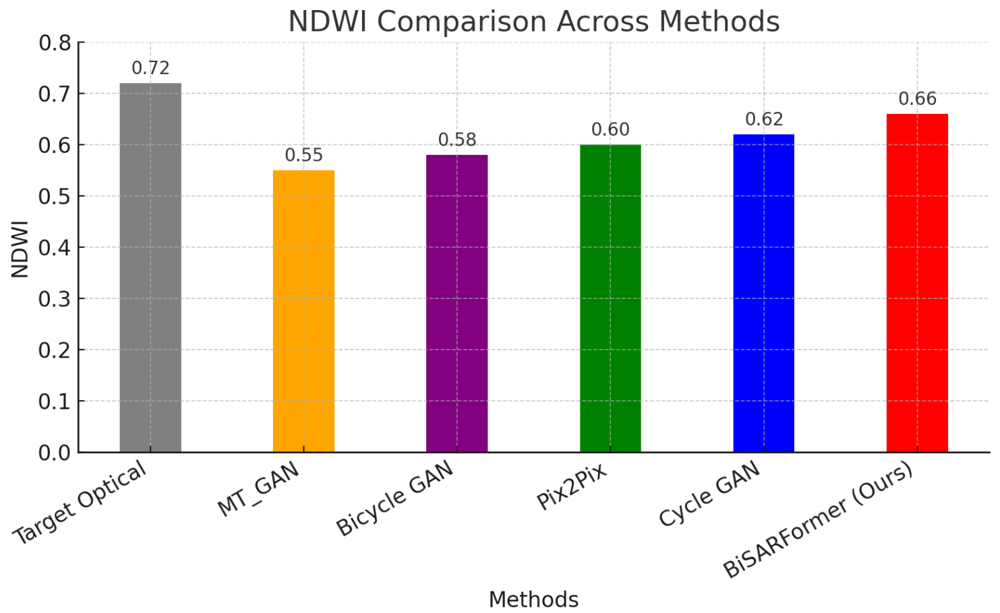

# D-PolTransGAN: Scattering Guided Hybrid Transformer-GAN for SAR-Optical Image Translation using Dual Polarization SAR  
D-PolTransGAN is a deep learning framework for translating Synthetic Aperture Radar (SAR) imagery into perceptually realistic optical imagery using dual polarization inputs (VV & VH) via local cross-attention fusion, and a Transformer-based generator within a GAN setup to capture complementary scattering patterns. 


The code is built on [MT_GAN (PyTorch)](https://github.com/NUAA-RS/MT_GAN) and tested on Ubuntu 20.04.6 environment (Python 3.10.13, PyTorch >= 1.1.0) with NVIDIA RTX A4000 with 16GB RAM. 
## Contents
1. [Introduction](#introduction)
2. [Key Highlights](#keyhighlights)
3. [Dependencies](#dependencies)
4. [Train](#train)
5. [Test](#test)
6. [Results](#results)
7. [Acknowledgements](#acknowledgements)

## Introduction

This repository contains the implementation of D-PolTransGAN:, a dual-band SAR-to-Optical translation framework designed for flood assessment. The architecture introduces dual-stem processing for Sentinel-1 VV and VH polarizations, followed by Scattering-Guided Attention Fusion (SGAF) to exploit their complementary scattering properties. To balance local spatial detail and global contextual modeling, the network integrates CNN backbones with Transformer modules inside a GAN framework, enhanced by SE-gated skip connections.

Trained on the DeepFlood dataset, BiSARFormerGAN generates optical-like imagery that preserves fine-grained structures, improves perceptual quality, and supports reliable flood mapping and disaster response.


## Key Highlights:

 * Dual-Polarization Processing: Independent stems for SAR VV and VH bands, extracting complementary scattering features.

 * Scattering-Guided Attention Fusion (SGAF): Adaptive fusion mechanism that leverages interactions between VV and VH polarizations for richer representation.

 * Hybrid GAN–Transformer Framework: Combines the perceptual realism of GANs with the global contextual modeling power of Transformers.

 * SE-Gated Skip Connections: Noise-aware skip links that selectively pass useful features while suppressing SAR-induced artifacts.

 * Efficient and Stable Training: Incorporates Residual Swin Transformer Blocks and multi-loss optimization (L1, SSIM, perceptual, adversarial) for balanced realism and accuracy.

 * Superior Performance: Outperforms state-of-the-art SAR-to-Optical translation models on the DeepFlood dataset in PSNR, SSIM, and LPIPS, while producing interpretable optical-like outputs for real flood events.

 * D-PolTransGAN bridges SAR and optical modalities, improving the usability of SAR imagery for flood mapping, disaster response, and geospatial analysis.

## Dependencies
* Python 3.10.13
* PyTorch >= 1.1.0
* CUDA 12.2
* numpy
* skimage
* **imageio**
* matplotlib
* tqdm
* cv2 >= 3.xx (Only if you want to use video input/output)

## Train
### Prepare training data 

1. Download DEEPFLOOD Dataset, from [DEEPFLOOD dataset](https://figshare.com/articles/dataset/DEEPFLOOD_DATASET_High-Resolution_Dataset_for_Accurate_Flood_Mappingand_Segmentation/28328339).
2. Download SEN1FLOODS11 Dataset from [SEN1FLOODS11 dataset](https://github.com/cloudtostreet/Sen1Floods11)
3. Download SEN12MS Dataset from [SEN12MS dataset](https://mediatum.ub.tum.de/1474000) 

4. Use SAR_VH, SAR_VV  for Dual-Polarization input and UAV tiles for Target Optical

5. Create train, test and validation sets 70%, 15% & 15%

6. Specify '--dir_data' based on the image's path. 

For more information, please refer to [MT_GAN (PyTorch)](https://github.com/NUAA-RS/MT_GAN).

### Begin to train

Cd to 'src', run the following script to train models.

 **Use the train.py file in the src folder to begin training of the model**

    ```bash
    # Example Training
    python train.py 
    ```
## Test
### Quick start
1. Download DEEPFLOOD DATASET from [GEMS Lab](https://figshare.com/articles/dataset/DEEPFLOOD_DATASET_High-Resolution_Dataset_for_Accurate_Flood_Mappingand_Segmentation/28328339) and split the dataset into 70% train, 15% validation, & 15% test set.


Cd to 'src', run the following scripts.

 **Use the validation.py file in the src folder to begin training of the model**
 **Use the test.py file in the src folder to begin training of the model**

    ```bash
    
    # Example for Validation set
    python validation.py  
    ```
    ```bash
    
    # Example for Test set
    python test.py  
    ```


## Results
### Visual Patches


### Quantitative Results









## Acknowledgements
This code is built on [MT_GAN (PyTorch)](https://github.com/NUAA-RS/MT_GAN/tree/main) and [CycleGAN-PyTorch](https://junyanz.github.io/CycleGAN/). We thank the authors for sharing their codes.
